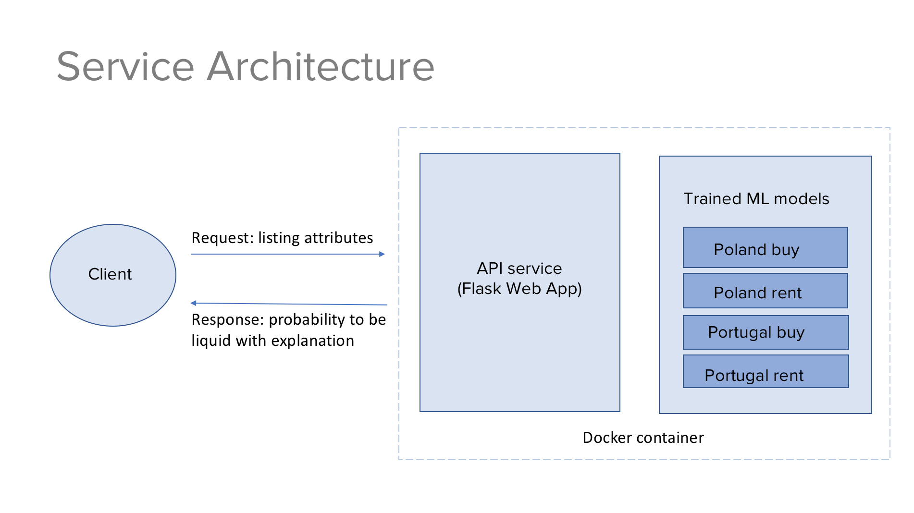

# README #

Here you can find a functionality for prediction listing probability to be liquid.
This service works for Otodom.pl and Imovirtual.pt, apartments for sell and
and apartments for rent.  

Technically we have 4 different models:
* Imovirtual, apartments to sell
* Imovirtual, apartments to rent
* Otodom, apartments to sell
* Otodom, apartments to rent

There are two parts:

* service  
* models 

### Service part ###

If you want to deploy a service for prediction listing probability go to the 
`service`. Follow the instruction are in the `service/README.md`

### Models part ###

In the directory `models` you find jupyter notebooks for data preparation and
models training. More details described in `models/README.md`

